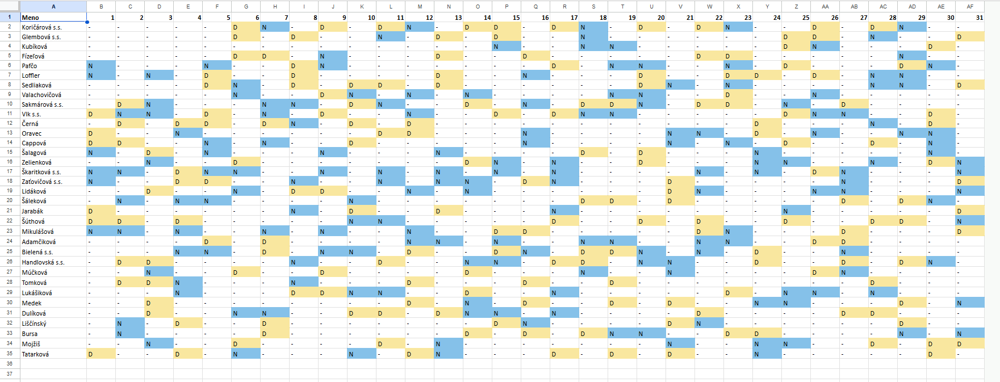
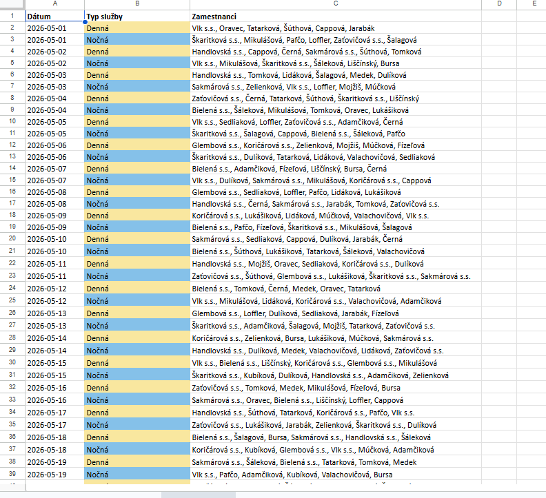

# Nurse Shift Scheduler

## Overview

This project is a Python-based tool designed to assist with generating monthly work schedules for hospital staff. It was created to simplify the process of assigning day and night shifts while respecting constraints such as employee availability, workload limits, and shift distribution rules.

The program automatically generates a valid schedule and exports it into both JSON and Excel formats for further use.

> [!WARNING]  
> This program was specifically designed according to the needs of a specific client and therefore operates in the Slovak language.

---

## Features

- Automatic generation of monthly shift schedules
- Support for day and night shifts
- Configurable number of shifts per employee
- Prevention of invalid shift patterns (e.g., repeated shifts)
- Option to input employee time-off requests via a simple UI
- Export of results to:
  - JSON (structured data)
  - Excel (readable schedule)
- Terminal output for quick overview

---

## Screenshots of the excel output




---

## Scheduling Rules

The scheduler enforces several constraints:

- Fixed number of employees per shift:
  - Day shift: 6 employees
  - Night shift: 6 employees
- At least one designated shift nurse ("s.s.") must be present in each shift
- Employees cannot:
  - Work the same type of shift repeatedly without restriction
  - Work a day shift immediately after a night shift
- Employees have a maximum number of shifts per month
- Employee time-off requests are respected

If a valid schedule cannot be generated, the system retries multiple times before failing.

---


## Input Files

### `mena.txt`

A text file containing employee names (one per line).

Employees marked with `"s.s."` are treated as qualified shift nurses and are required in each shift.

---

## How to Run

1. Place your employee list in `mena.txt`.

2. Run the script:
```bash
python main.py
```

3. Provide required input when prompted:
- Month (numeric, e.g., `11` for November)
- Year (e.g., `2026`)
- Maximum number of shifts per employee

4. A graphical interface will open:
- Select an employee
- Mark days off using checkboxes
- Save time-off requests
- Start schedule generation

---

## Output

After successful generation, the program produces:

### JSON File

`sluzby_mesacne.json`
Contains structured schedule data.

### Excel File

`sluzby_mesacne_<month>_<year>.xlsx`

### Includes:

- Sheet 1: Schedule by employee (rows = employees, columns = days)
- Sheet 2: Schedule by day (day and night shifts with assigned staff)
